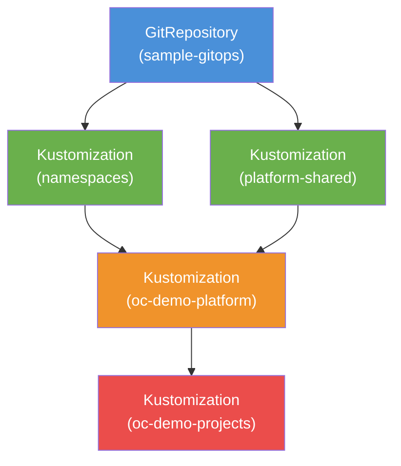

# GitOps with Flux CD

This tutorial walks through setting up a complete GitOps workflow using OpenChoreo and Flux CD with this sample-gitops repository. You will configure Flux for resource synchronization, build and deploy a multi-component application using OpenChoreo Workflows, and promote components across environments.

**Learning objectives:**

- Flux CD setup for OpenChoreo resource synchronization
- GitOps repository structure (platform vs. namespace organization)
- Component building and deployment automation via OpenChoreo Workflows
- ComponentReleases and ReleaseBindings for environment promotion
- Development to staging pipeline execution (bulk component promotion)

## Table of Contents

- [Prerequisites](#prerequisites)
- [Step 1: Fork and Clone the Sample Repository](#step-1-fork-and-clone-the-sample-repository)
- [Step 2: Update Repository URLs](#step-2-update-repository-urls)
- [Step 3: Create Git Secrets](#step-3-create-git-secrets)
- [Step 4: Deploy Flux Resources](#step-4-deploy-flux-resources)
- [Step 5: Verify Platform Resources](#step-5-verify-platform-resources)
- [Step 6: Build and Deploy the Doclet Application](#step-6-build-and-deploy-the-doclet-application)
- [Step 7: Promote to Staging](#step-7-promote-to-staging)
- [Step 8: Environment-Specific Overrides](#step-8-environment-specific-overrides)
- [Clean Up](#clean-up)

---

## Prerequisites

### Install OpenChoreo

Follow the official documentation: [Try it out on k3d locally](https://openchoreo.dev/docs/next/getting-started/try-it-out/on-k3d-locally/)

> [!WARNING]
> Do **not** install the OpenChoreo default resources. Only create the **default clusterdataplane** and **clusterworkflowplane**.

### Required Tools

- `kubectl` configured for cluster access
- `git` CLI installed
- A GitHub account for repository forking

### Install Flux CD

Flux CD requires the source-controller and kustomize-controller components. Follow the [official Flux installation guide](https://fluxcd.io/flux/installation/#dev-install), or run:

```bash
kubectl apply -f https://github.com/fluxcd/flux2/releases/latest/download/install.yaml
```

> [!NOTE]
> This tutorial assumes a k3d local setup. Adjust accordingly for other cluster types.

---

## Step 1: Fork and Clone the Sample Repository

1. Navigate to the [sample-gitops](https://github.com/openchoreo/sample-gitops) GitHub repository.
2. Click **Fork** in the top-right corner.
3. Clone your forked repository locally:

```bash
git clone https://github.com/<your-github-username>/sample-gitops.git
cd sample-gitops
```

---

## Step 2: Update Repository URLs

Flux and the build workflows need to know the location of your forked repository.

### 2.1 Update the Flux GitRepository

Edit [`flux/gitrepository.yaml`](./gitrepository.yaml) and update the `spec.url` field:

```yaml
apiVersion: source.toolkit.fluxcd.io/v1
kind: GitRepository
metadata:
  name: sample-gitops
  namespace: flux-system
spec:
  interval: 1m
  url: https://github.com/<your-github-username>/sample-gitops
  ref:
    branch: main
```

### 2.2 Update Workflow files

Update the `gitops-repo-url` parameter in each of the following workflow files to point to your fork:

- [`namespaces/default/platform/workflows/docker-with-gitops.yaml`](../namespaces/default/platform/workflows/docker-with-gitops-release.yaml)
- [`namespaces/default/platform/workflows/google-cloud-buildpacks-gitops-release.yaml`](../namespaces/default/platform/workflows/google-cloud-buildpacks-gitops-release.yaml)
- [`namespaces/default/platform/workflows/react-gitops-release.yaml`](../namespaces/default/platform/workflows/react-gitops-release.yaml)

Commit and push all URL changes to your forked repository.

### 2.3 Generate a GitHub PAT

Generate a [GitHub Personal Access Token (PAT)](https://docs.github.com/en/authentication/keeping-your-account-and-data-secure/managing-your-personal-access-tokens) with read/write access to your forked repository.

> [!NOTE]
> If your repository is **private**, you will also need to configure a Flux secret for Git authentication. See the [Flux secret management guide](https://fluxcd.io/flux/cmd/flux_create_secret_git/).

---

## Step 3: Create Git Secrets

[OpenChoreo Workflows](../namespaces/default/platform/workflows/README.md) need access to your repositories for cloning source code and pushing GitOps manifests. Store your GitHub PAT in the OpenBao secret store:

```bash
# Secret for cloning source repositories
kubectl exec -n openbao openbao-0 -- bao kv put secret/git-token git-token=<your_github_pat>

# Secret for pushing to and creating PRs in the GitOps repository
kubectl exec -n openbao openbao-0 -- bao kv put secret/gitops-token git-token=<your_github_pat>
```

Replace `<your_github_pat>` with your actual token.

---

## Step 4: Deploy Flux Resources

Apply all Flux resources to start syncing this repository with your cluster:

```bash
kubectl apply -f flux/
```

This creates five resources:

| Resource | Purpose |
|---|---|
| **GitRepository** (`sample-gitops`) | Monitors the forked repository for changes |
| **Kustomization** (`namespaces`) | Syncs the `namespaces/` directory |
| **Kustomization** (`platform-shared`) | Syncs the `platform-shared/` directory |
| **Kustomization** (`oc-demo-platform`) | Syncs the `platform/` directory; depends on namespaces and platform-shared |
| **Kustomization** (`oc-demo-projects`) | Syncs the `projects/` directory; depends on oc-demo-platform |

Flux uses `dependsOn` to enforce the correct apply order:



This ensures that namespaces and cluster-scoped resources are created first, followed by platform resources (Environments, ComponentTypes, Workflows), and finally the application resources (Projects, Components).

Verify the resources are created:

```bash
kubectl get gitrepository,kustomization -n flux-system
```

To trigger an immediate sync:

```bash
kubectl annotate gitrepository -n flux-system sample-gitops \
  reconcile.fluxcd.io/requestedAt="$(date +%s)" --overwrite
```

---

## Step 5: Verify Platform Resources

Within 1-2 minutes, Flux will sync the platform directory. Verify the platform resources:

```bash
kubectl get environments              # development, staging, production
kubectl get deploymentpipelines       # standard
kubectl get componenttypes            # deployment/service, deployment/web-application, deployment/database, deployment/message-broker
```

The `standard` DeploymentPipeline defines the promotion sequence: **development** -> **staging** -> **production**.

---

## Step 6: Build and Deploy the Doclet Application

The sample uses the **Doclet** application. Which is a multi-component system with two backend services and a frontend. The `postgres` DB and `nats` broker is deployed by default. Other components will be deployed by triggering OpenChoreo Workflow runs that build container images and create pull requests in your GitOps repository.

### 6.1 Document Service

```bash
kubectl apply -f - <<EOF
apiVersion: openchoreo.dev/v1alpha1
kind: WorkflowRun
metadata:
  name: document-svc-manual-01
  namespace: default
  labels:
    openchoreo.dev/project: "doclet"
    openchoreo.dev/component: "document-svc"
spec:
  workflow:
    name: docker-gitops-release
    kind: Workflow
    parameters:
      componentName: document-svc
      projectName: doclet
      docker:
        context: /project-doclet-app/service-go-document
        filePath: /project-doclet-app/service-go-document/Dockerfile
      repository:
        appPath: /project-doclet-app/service-go-document
        revision:
          branch: main
          commit: ""
        url: https://github.com/openchoreo/sample-workloads.git
      workloadDescriptorPath: workload.yaml
EOF
```

### 6.2 Collaboration Service

```bash
kubectl apply -f - <<EOF
apiVersion: openchoreo.dev/v1alpha1
kind: WorkflowRun
metadata:
  name: collab-svc-manual-01
  namespace: default
  labels:
    openchoreo.dev/project: "doclet"
    openchoreo.dev/component: "collab-svc"
spec:
  workflow:
    kind: Workflow
    name: docker-gitops-release
    parameters:
      componentName: collab-svc
      projectName: doclet
      docker:
        context: /project-doclet-app/service-go-collab
        filePath: /project-doclet-app/service-go-collab/Dockerfile
      repository:
        appPath: /project-doclet-app/service-go-collab
        revision:
          branch: main
          commit: ""
        url: https://github.com/openchoreo/sample-workloads.git
      workloadDescriptorPath: workload.yaml
EOF
```

### 6.3 Frontend

```bash
kubectl apply -f - <<EOF
apiVersion: openchoreo.dev/v1alpha1
kind: WorkflowRun
metadata:
  name: frontend-workflow-manual-01
  namespace: default
  labels:
    openchoreo.dev/project: "doclet"
    openchoreo.dev/component: "frontend"
spec:
  workflow:
    kind: Workflow
    name: docker-gitops-release
    parameters:
      componentName: frontend
      projectName: doclet
      docker:
        context: /project-doclet-app/webapp-react-frontend
        filePath: /project-doclet-app/webapp-react-frontend/Dockerfile
      repository:
        appPath: /project-doclet-app/webapp-react-frontend
        revision:
          branch: main
          commit: ""
        url: https://github.com/openchoreo/sample-workloads.git
      workloadDescriptorPath: workload.yaml
EOF
```

> [!NOTE]
> The source code for the Doclet application is available at [openchoreo/sample-workloads](https://github.com/openchoreo/sample-workloads/tree/main/project-doclet-app).


### 6.4 Merge the Pull Requests

Once all three workflows complete, **3 pull requests** will be created in your forked GitOps repository. One for each component. Each PR contains `Workload`, `ComponentRelease`, and `ReleaseBinding` manifests targeting the **development** environment.

Review and merge all pull requests, then wait for Flux to sync and deploy the components.

### 6.5 Verify the Deployment

```bash
kubectl get releasebindings
kubectl get deployments -A
kubectl get pods -A
```

---

## Step 7: Promote to Staging

After validating in the development environment, promote the entire **Doclet** project to staging using the bulk release workflow:

```bash
kubectl apply -f - <<EOF
apiVersion: openchoreo.dev/v1alpha1
kind: WorkflowRun
metadata:
  name: bulk-release-manual-01
  namespace: default
spec:
  workflow:
    kind: Workflow
    name: bulk-gitops-release
    parameters:
      scope:
        all: false
        projectName: "doclet"
      gitops:
        repositoryUrl: "https://github.com/<your-github-username>/sample-gitops"
        branch: "main"
        targetEnvironment: "staging"
        deploymentPipeline: "standard"
EOF
```

Replace `<your-github-username>` with your GitHub username. Once the workflow completes, a pull request will be created to promote all Doclet components from development to staging in a single operation.

Merge the pull request and wait for Flux to sync, then verify:

```bash
kubectl get releasebindings
```

You should see ReleaseBindings for both the **development** and **staging** environments. The same ComponentReleases are deployed to multiple environments, demonstrating the ReleaseBinding model: **one immutable release, multiple environments**.

---

## Step 8: Environment-Specific Overrides

Different environments often require different configurations. For example, staging might use different database endpoints or log levels than development. In OpenChoreo, the **ReleaseBinding** defines environment-specific overrides.

### Override types

| Override Type                     | Purpose                                                               |
|-----------------------------------|-----------------------------------------------------------------------|
| `componentTypeEnvironmentConfigs` | Override ComponentType parameters for specific environments           |
| `traitEnvironmentConfigs`         | Override Trait configurations for specific environments               |
| `workloadOverrides`               | Override workload-level settings (environment variables, file mounts) |

> [!IMPORTANT]
> Environment-specific overrides are not supported by the included GitOps workflows. You must manually add override configurations to the ReleaseBinding manifests and commit them to the GitOps repository.

This approach maintains ComponentRelease immutability, and the same release artifact deploys everywhere, with only configuration varying per environment.

### Rollback

To roll back a component, update the `releaseName` in the ReleaseBinding to point to the previous ComponentRelease name and push the change. OpenChoreo handles the rest.

---

## Clean Up

Remove the Flux resources to stop syncing:

```bash
kubectl delete -f flux/
```
